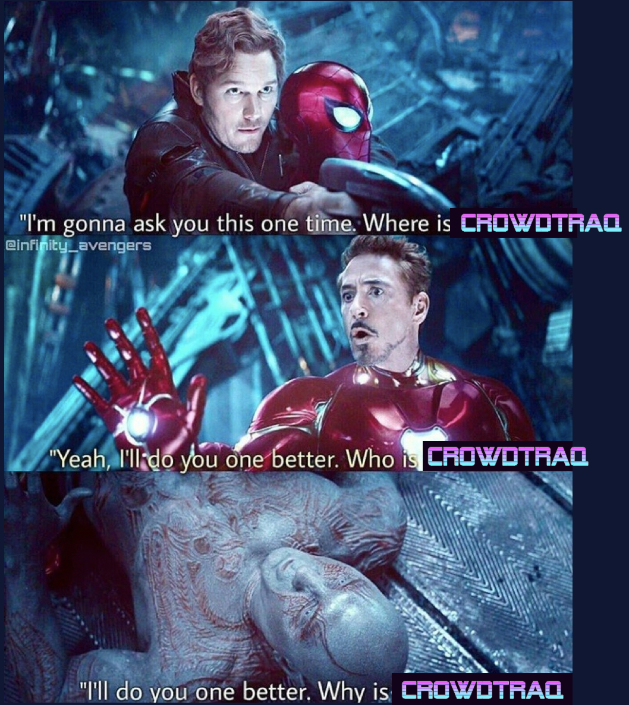

# CrowdTraQ Client v2.0:
## Real-time playlist creation with the Crowd, by the Crowd

Have you passed the aux cord only to realize with utter despair that you have relinquished control to someone who thinks good music is nothing more than a hideous disgrace against nature itself? 

Previously you had to be the authoritarian to take back control, or perhaps you relied on your trusted allies to publically shame the offender. You can do that still, but now with **CrowdTraQ**, based on the majority of the crowd. A little group-think never hurt anyone...

Everyone begins with 12 tokens (first round is on the house). Use these tokens to queue up songs of your choice (as long as they are on Spotify), but the number of tokens required to add songs *increases* with the size of the queue. If you don't have enough tokens to add now, don't worry; if there are no songs queued up, adding a song is free!

Want more tokens? Add songs that you think the majority of people will like, at least enough to hit the :fire: button anyway. Yes, you can give yourself the shameless self-vote -- don't worry, I won't tell anybody. :wink:

Trolls, beware! If the majority of people hate a song that you had queued up so much they hit the dislike button, that song ends (even before it officially does) and you don't get those tokens back. :sob:

:tada: So get the room code from the party host and add to the party vibes! :tada:

Version 1 was designed initially to fulfill capstone graduation requirements for the Master of Software Development Program from the University of Utah. Immediate plans for these repos include: archiving. 

This project was bootstrapped with [Create React App](https://github.com/facebook/create-react-app).